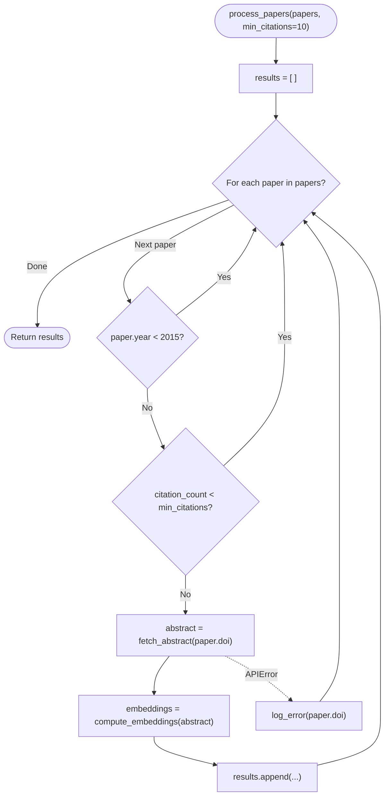
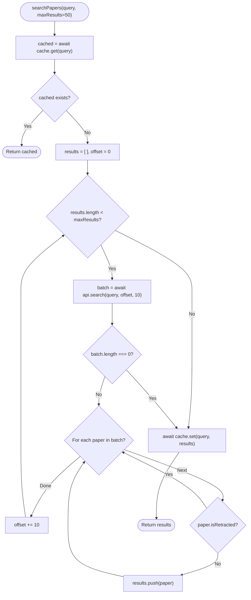
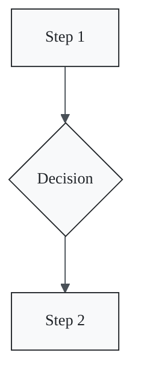

# Code Flow Visualizer

Convert Python, JavaScript, and TypeScript functions into Mermaid flowcharts by analyzing control flow structures. This skill helps researchers document and understand complex algorithmic logic, data processing pipelines, and experimental workflows embedded in code.

## Overview

Research code often contains intricate control flow: nested conditionals for data filtering, loops over experimental conditions, error handling for API calls, and branching logic for different analysis paths. Understanding this flow is critical for reproducibility, code review, and documentation, yet reading nested code can be cognitively demanding.

This skill translates source code into visual Mermaid flowcharts by parsing control flow structures (if/else, for/while loops, try/catch, match/switch, return statements) and mapping them to flowchart nodes and edges. The resulting diagrams serve as documentation supplements in README files, lab notebooks, and paper appendices.

The approach works by performing a lightweight static analysis of the code's abstract syntax tree (AST). Each control structure maps to a specific flowchart pattern: conditionals become diamond decision nodes, loops become cycles with back-edges, function calls become subroutine nodes, and return statements become terminal nodes.

## Conversion Rules

### Control Flow Mapping

| Code Structure | Flowchart Element | Mermaid Shape |
|---------------|-------------------|---------------|
| Function entry | Start node | `([Function Name])` |
| Assignment / expression | Process node | `[statement]` |
| `if` / `else if` | Decision diamond | `{condition?}` |
| `for` / `while` loop | Decision + back-edge | `{loop condition?}` with cycle |
| `try` / `catch` | Process + error path | `[try block]` with dashed error edge |
| `return` / `yield` | Terminal / output node | `([return value])` |
| Function call | Subroutine node | `[[function_name()]]` |
| `match` / `switch` | Multi-branch decision | `{value?}` with labeled edges |

### Python Example

**Input code:**

```python
def process_papers(papers, min_citations=10):
    results = []
    for paper in papers:
        if paper.year < 2015:
            continue
        if paper.citation_count < min_citations:
            continue
        try:
            abstract = fetch_abstract(paper.doi)
            embeddings = compute_embeddings(abstract)
            results.append({"paper": paper, "embedding": embeddings})
        except APIError:
            log_error(paper.doi)
    return results
```

**Output flowchart:**



### JavaScript / TypeScript Example

**Input code:**

```typescript
async function searchPapers(query: string, maxResults: number = 50): Promise<Paper[]> {
    const cached = await cache.get(query);
    if (cached) return cached;

    const results: Paper[] = [];
    let offset = 0;

    while (results.length < maxResults) {
        const batch = await api.search(query, offset, 10);
        if (batch.length === 0) break;

        for (const paper of batch) {
            if (paper.isRetracted) continue;
            results.push(paper);
        }
        offset += 10;
    }

    await cache.set(query, results);
    return results;
}
```

**Output flowchart:**



## Handling Complex Patterns

### Nested Conditionals

Deeply nested if/else chains are flattened into a decision tree. Each branch is labeled with its condition, and nodes at the same depth are arranged vertically for readability.

### Recursive Functions

Recursive calls are shown as subroutine nodes with a self-referencing edge back to the function start node. A note annotation indicates the recursion base case.

### Generator Functions (yield)

Python generators use `yield` as intermediate output nodes (shown as parallelogram shapes). The flowchart shows the suspension point and resumption path.

### Error Handling Chains

Multiple `except` clauses create parallel error paths from the `try` block, each labeled with the exception type. `finally` blocks are shown as a converging node that all paths pass through.

## Styling for Documentation

### Academic Paper Style



### Export for LaTeX

```bash
# Render Mermaid to PDF for LaTeX inclusion
mmdc -i flowchart.mmd -o flowchart.pdf -t neutral -b transparent
```

```latex
\begin{figure}[h]
    \centering
    \includegraphics[width=0.8\textwidth]{flowchart.pdf}
    \caption{Control flow of the data processing pipeline.}
    \label{fig:flowchart}
\end{figure}
```

## Limitations and Best Practices

1. **Scope**: Works best for functions under 100 lines. For larger codebases, visualize individual functions or extract key subroutines.
2. **Dynamic dispatch**: Cannot trace through dynamic method resolution or callback chains. Show these as labeled subroutine nodes.
3. **Concurrency**: Async/await is shown sequentially. Concurrent branches (e.g., `Promise.all`) are noted but not fully modeled.
4. **Simplification**: Omit trivial assignments and logging statements to keep diagrams focused on control flow.

## References

- Mermaid flowchart syntax: https://mermaid.js.org/syntax/flowchart.html
- Python AST module: https://docs.python.org/3/library/ast.html
- TypeScript Compiler API: https://github.com/microsoft/TypeScript/wiki/Using-the-Compiler-API
- Code2Flow (related tool): https://github.com/scottrogowski/code2flow
