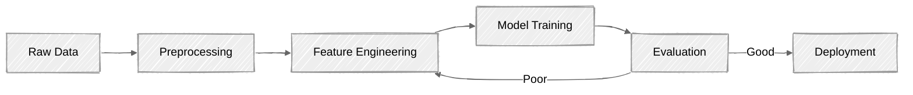
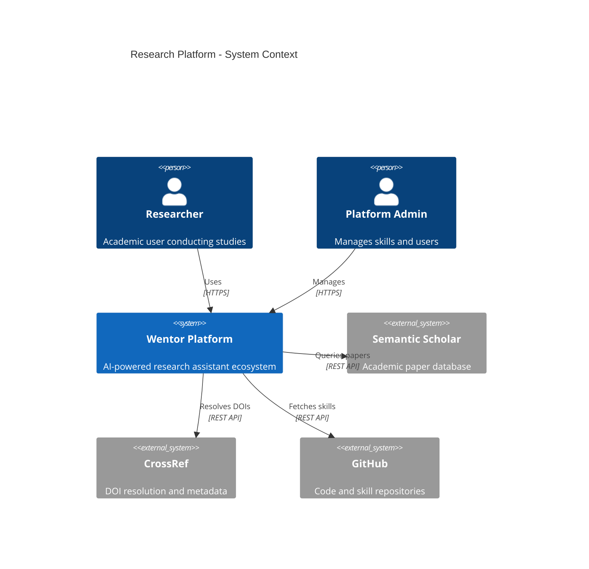
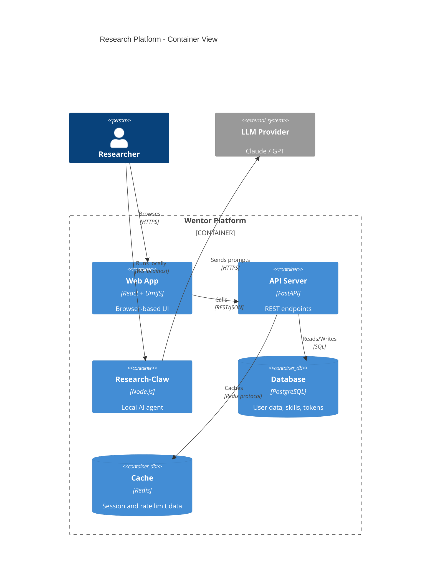
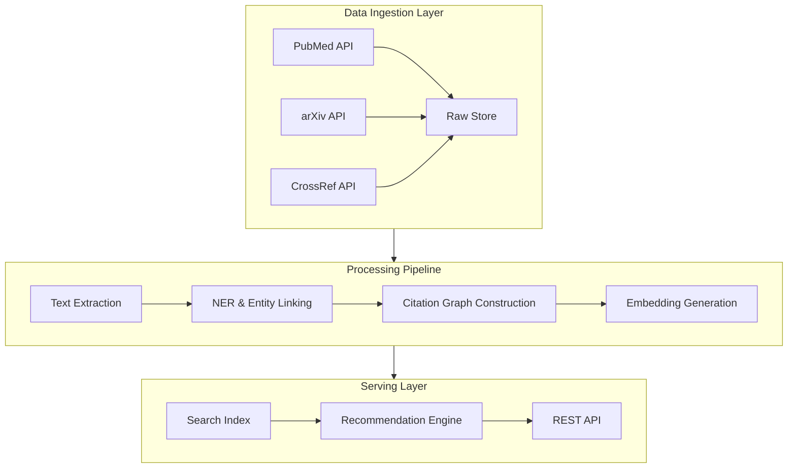
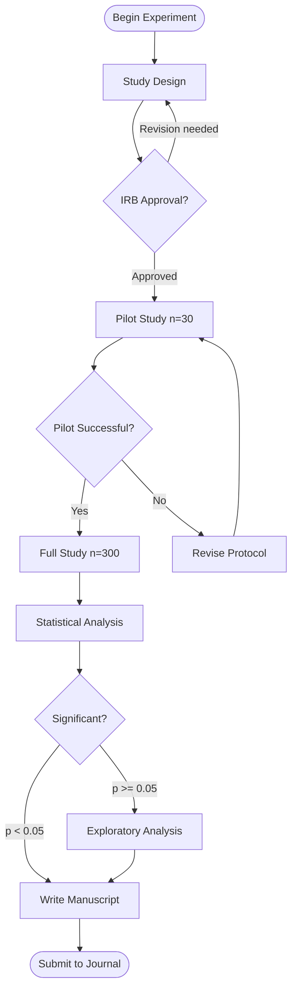
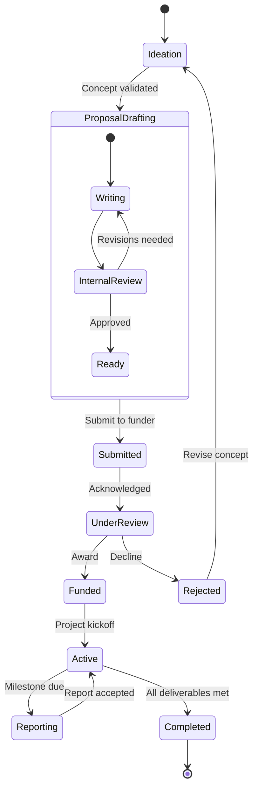
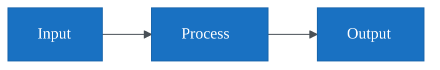

# Mermaid Architect Guide

Design complex, multi-view system architectures and research infrastructure diagrams using advanced Mermaid features including C4 diagrams, hand-drawn rendering mode, subgraph nesting, and theme customization.

## Overview

While basic Mermaid flowcharts are widely known, Mermaid's advanced capabilities enable sophisticated architectural documentation that rivals dedicated tools like Structurizr or Draw.io. This skill focuses on the architectural use cases that matter most to research teams: depicting multi-layer systems, data pipelines, deployment topologies, and complex experimental workflows.

Mermaid v11+ introduced a hand-drawn rendering mode (via the `handDrawn` look) that produces a sketch-like aesthetic similar to Excalidraw but with the convenience of text-based Markdown embedding. This makes it ideal for research proposals and informal documentation where a polished diagram would feel premature.

Research software systems often involve intricate interactions between data sources, processing pipelines, ML models, and visualization layers. The C4 model support in Mermaid allows teams to document these systems at multiple levels of abstraction -- from high-level context diagrams down to detailed component views -- all in version-controlled Markdown files.

## Hand-Drawn Mode

Enable the sketchy, informal rendering style:



The `handDrawn` look applies rough.js-style rendering to all elements, giving them a natural sketched appearance. This is particularly useful for early-stage architecture discussions and research proposals.

## C4 Architecture Diagrams

### Context Diagram (Level 1)



### Container Diagram (Level 2)



## Advanced Subgraph Patterns

### Nested Research Pipeline



### Experiment Workflow with Decision Gates



## State Diagrams for Research Processes



## Theme Customization



## Rendering and Integration

| Platform | Support | Notes |
|----------|---------|-------|
| GitHub Markdown | Native | Renders in README, issues, PRs |
| GitLab | Native | Full Mermaid support |
| Obsidian | Native | Real-time preview |
| Notion | Via embed | Use mermaid.ink URL encoding |
| LaTeX | Pre-render | Use `mmdc` CLI to export SVG/PDF |
| Jupyter | Via plugin | `mermaid-py` or iframe rendering |

### CLI Rendering

```bash
# Install Mermaid CLI
npm install -g @mermaid-js/mermaid-cli

# Render to SVG
mmdc -i architecture.mmd -o architecture.svg -t neutral

# Render with hand-drawn look
mmdc -i architecture.mmd -o sketch.svg --configFile mermaid-config.json
```

## References

- Mermaid official documentation: https://mermaid.js.org
- C4 model specification: https://c4model.com
- Mermaid CLI (mmdc): https://github.com/mermaid-js/mermaid-cli
- Mermaid Live Editor: https://mermaid.live
