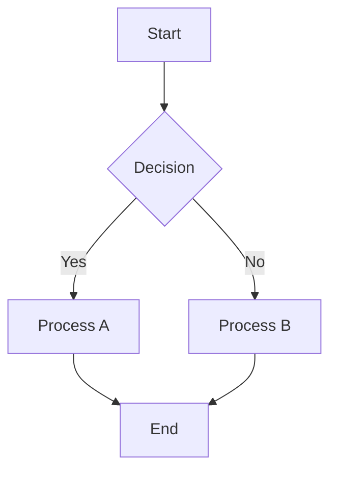
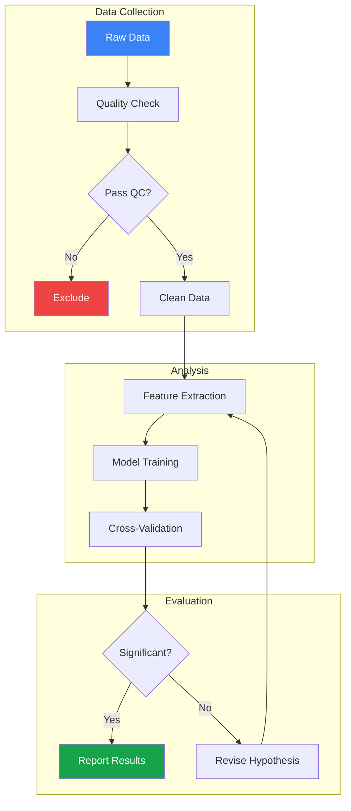
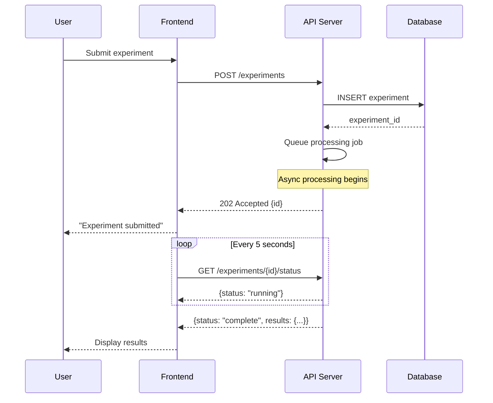
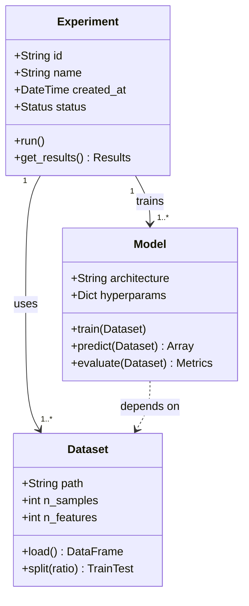
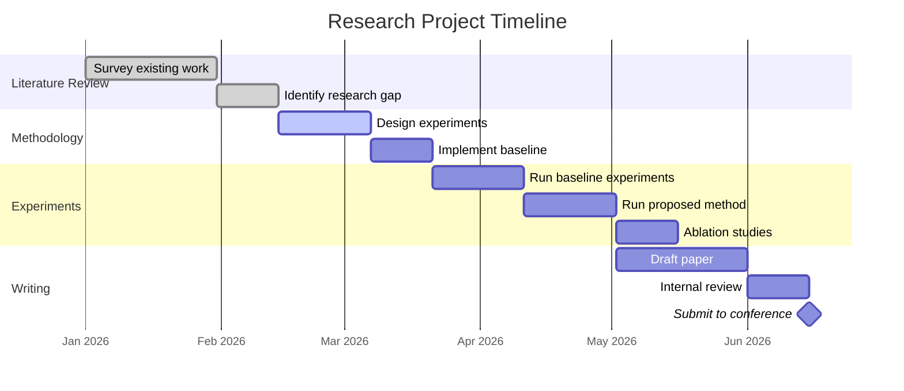
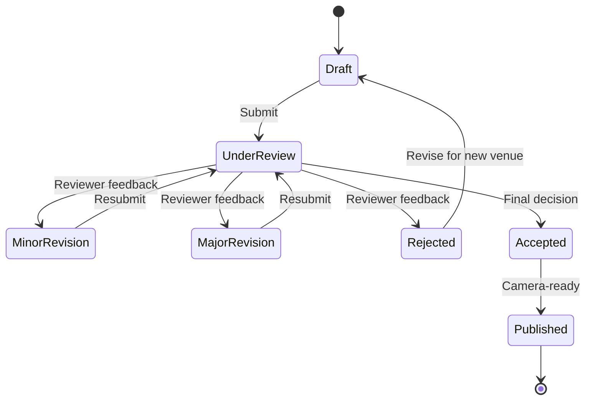
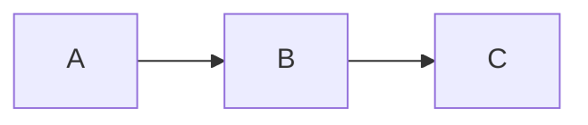

# Mermaid Diagram Guide

## Overview

Mermaid is a text-based diagramming tool that renders diagrams from Markdown-like syntax. For researchers, Mermaid offers a unique combination of version-controllable source code, instant rendering in documentation platforms (GitHub, GitLab, Notion, Obsidian), and enough expressiveness to create flowcharts, sequence diagrams, class diagrams, Gantt charts, and more.

Unlike graphical tools like draw.io or Lucidchart, Mermaid diagrams live as plain text in your documentation, making them easy to maintain alongside code and papers. They are especially valuable for research documentation, README files, software architecture diagrams in methods sections, and graphical abstracts.

This guide covers the most useful Mermaid diagram types for academic work, with complete syntax references and real-world examples from research contexts. Each diagram type includes a template you can copy and modify for your specific needs.

## Flowcharts

Flowcharts are the most common diagram type for describing algorithms, experimental procedures, and data processing pipelines.

### Basic Syntax



### Node Shapes

| Shape | Syntax | Use Case |
|-------|--------|----------|
| Rectangle | `A[text]` | Process step |
| Rounded | `A(text)` | Start/end |
| Diamond | `A{text}` | Decision |
| Hexagon | `A{{text}}` | Preparation |
| Parallelogram | `A[/text/]` | Input/output |
| Circle | `A((text))` | Connector |
| Stadium | `A([text])` | Terminal |

### Research Pipeline Example



### Direction Options

| Direction | Code | Description |
|-----------|------|-------------|
| Top to bottom | `TD` or `TB` | Default, vertical |
| Bottom to top | `BT` | Vertical, upward |
| Left to right | `LR` | Horizontal |
| Right to left | `RL` | Horizontal, reversed |

## Sequence Diagrams

Sequence diagrams show interactions between components over time. They are ideal for describing API calls, protocol steps, and system interactions.



### Arrow Types

| Arrow | Syntax | Meaning |
|-------|--------|---------|
| Solid with arrowhead | `->>` | Synchronous call |
| Dotted with arrowhead | `-->>` | Response/return |
| Solid | `->` | Message |
| Dotted | `-->` | Optional message |
| Cross | `-x` | Failed message |

## Class Diagrams

Class diagrams document code architecture and data models:



## Gantt Charts

Gantt charts are useful for project timelines and research plans:



## State Diagrams

State diagrams model entity lifecycles:



## Rendering and Integration

### GitHub / GitLab

Both platforms render Mermaid natively in Markdown files:

````markdown

````

### Command-Line Rendering

```bash
# Install Mermaid CLI
npm install -g @mermaid-js/mermaid-cli

# Render to PNG
mmdc -i diagram.mmd -o diagram.png -w 1200

# Render to SVG (preferred for papers)
mmdc -i diagram.mmd -o diagram.svg

# Render to PDF
mmdc -i diagram.mmd -o diagram.pdf
```

### Embedding in LaTeX

```latex
% Include the SVG generated by mmdc
\usepackage{svg}
\begin{figure}[h]
  \centering
  \includesvg[width=0.8\textwidth]{diagram}
  \caption{System architecture overview.}
\end{figure}
```

## Best Practices

- **Keep diagrams focused.** One concept per diagram. If it exceeds 15-20 nodes, split it.
- **Use subgraphs for grouping.** They clarify which components belong together.
- **Label all edges.** Unlabeled arrows are ambiguous.
- **Use consistent styling.** Define colors for success (green), failure (red), and process (blue) states.
- **Export as SVG for papers.** SVG scales perfectly and produces crisp output at any size.
- **Version-control your diagrams.** Since Mermaid is text, it diffs cleanly in Git.
- **Test in the live editor.** Use [mermaid.live](https://mermaid.live/) to iterate quickly before committing.

## References

- [Mermaid Documentation](https://mermaid.js.org/) -- Official reference
- [Mermaid Live Editor](https://mermaid.live/) -- Interactive diagram editor
- [Mermaid CLI](https://github.com/mermaid-js/mermaid-cli) -- Command-line rendering tool
- [GitHub Mermaid Support](https://github.blog/2022-02-14-include-diagrams-markdown-files-mermaid/) -- Native rendering in GitHub
