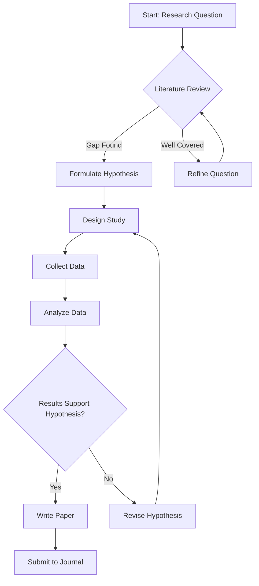
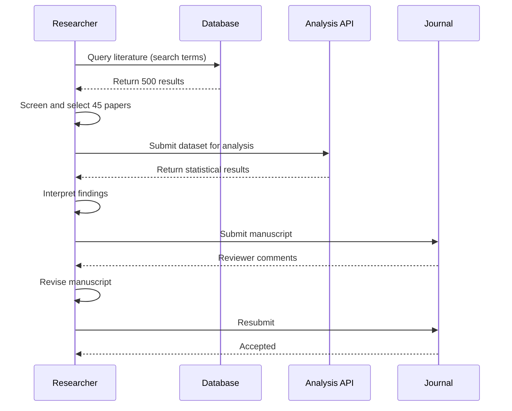
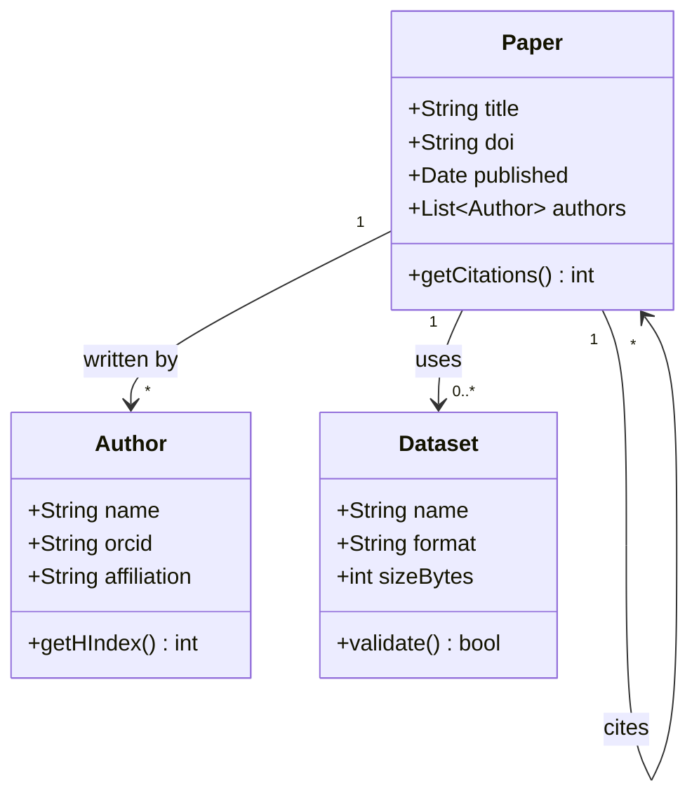
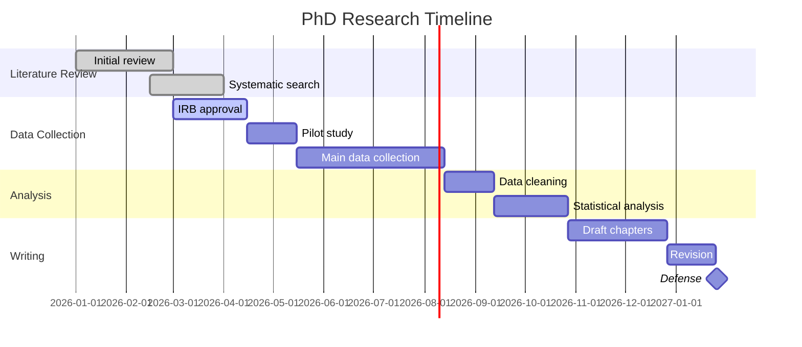
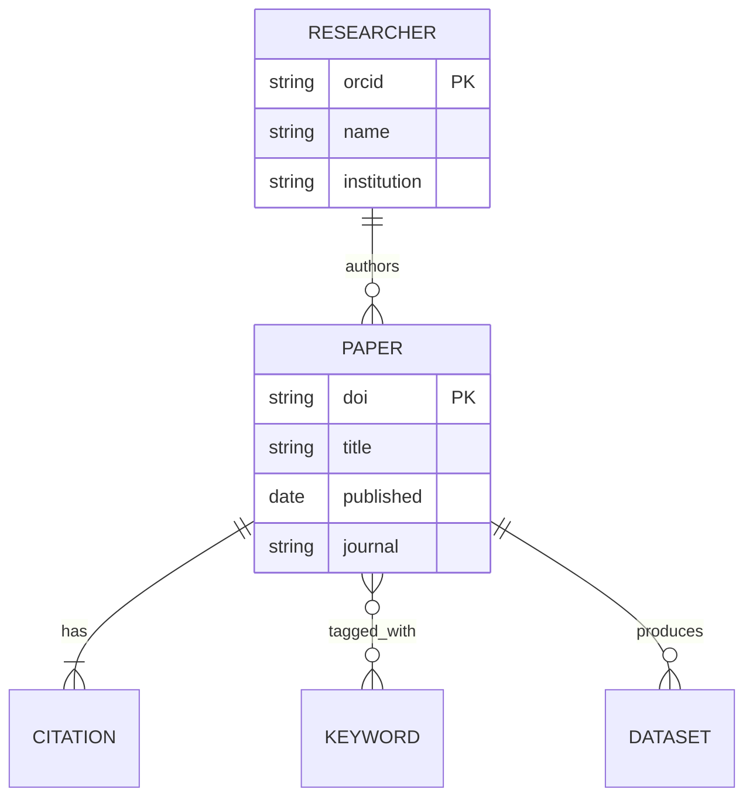
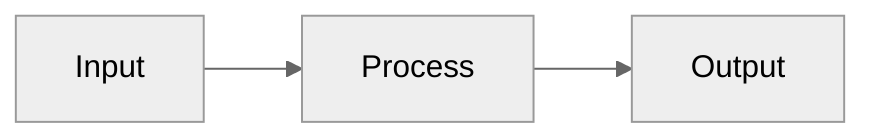

# Mermaid Diagrams Guide

A skill for creating diagrams using Mermaid.js syntax, which renders directly in Markdown on GitHub, GitLab, Notion, Obsidian, and many documentation tools. Covers flowcharts, sequence diagrams, class diagrams, Gantt charts, and entity-relationship diagrams for research documentation.

## Flowcharts

### Basic Flowchart Syntax



### Node Shapes

```
graph LR
    A[Rectangle]       -- Default shape
    B(Rounded)         -- Rounded rectangle
    C([Stadium])       -- Stadium shape
    D[[Subroutine]]    -- Subroutine
    E[(Database)]      -- Cylinder
    F((Circle))        -- Circle
    G{Diamond}         -- Decision
    H>Asymmetric]      -- Flag shape
    I{{Hexagon}}       -- Hexagon
```

### Direction Options

```
graph TD   -- Top to Down (default)
graph LR   -- Left to Right
graph BT   -- Bottom to Top
graph RL   -- Right to Left
```

## Sequence Diagrams

### Research Workflow Communication



### Arrow Types

```
->>    Solid line with arrowhead
-->>   Dashed line with arrowhead
-x     Solid line with cross (lost message)
--x    Dashed line with cross
-)     Solid line with open arrow (async)
--)    Dashed line with open arrow (async)
```

## Class Diagrams

### Object Model for Research Data



## Gantt Charts

### Research Project Timeline



## Entity-Relationship Diagrams

### Database Schema for Research



## Practical Tips

### Embedding in Documentation

```markdown
To render Mermaid in Markdown files:

GitHub:    Supported natively in .md files (use ```mermaid code blocks)
GitLab:    Supported natively
Obsidian:  Supported natively
Notion:    Use /mermaid block
Jupyter:   Use mermaid-js or nb_mermaid extension
LaTeX:     Export as SVG/PDF, include with \includegraphics

For platforms that do not support Mermaid natively:
  - Mermaid CLI (mmdc): Renders to SVG/PNG/PDF from command line
  - Mermaid Live Editor (mermaid.live): Browser-based editor and export
```

### Styling and Themes



Available themes: `default`, `neutral`, `dark`, `forest`, `base`.

### Common Pitfalls

```
1. Special characters in node labels need quotes:
   BAD:  A[R^2 = 0.95]
   GOOD: A["R^2 = 0.95"]

2. Avoid very long labels (wrap text manually):
   A["This is a very long label<br/>that wraps across lines"]

3. Subgraphs for grouping:
   subgraph "Data Collection Phase"
     A --> B --> C
   end
```

Mermaid is particularly useful for research because diagrams live alongside your code and documentation in version control, making them easy to update as your project evolves.
