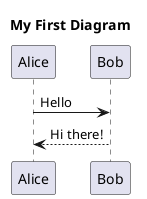
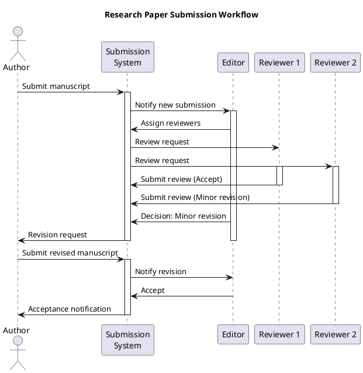
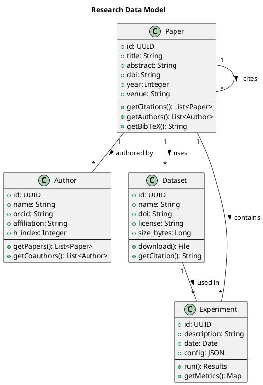
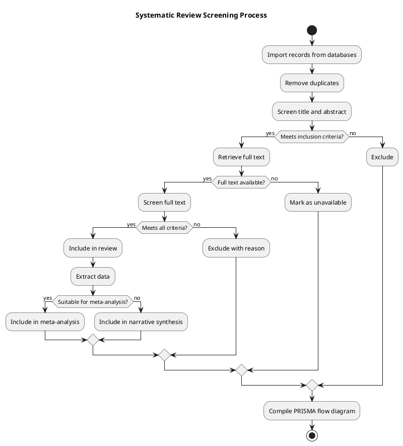
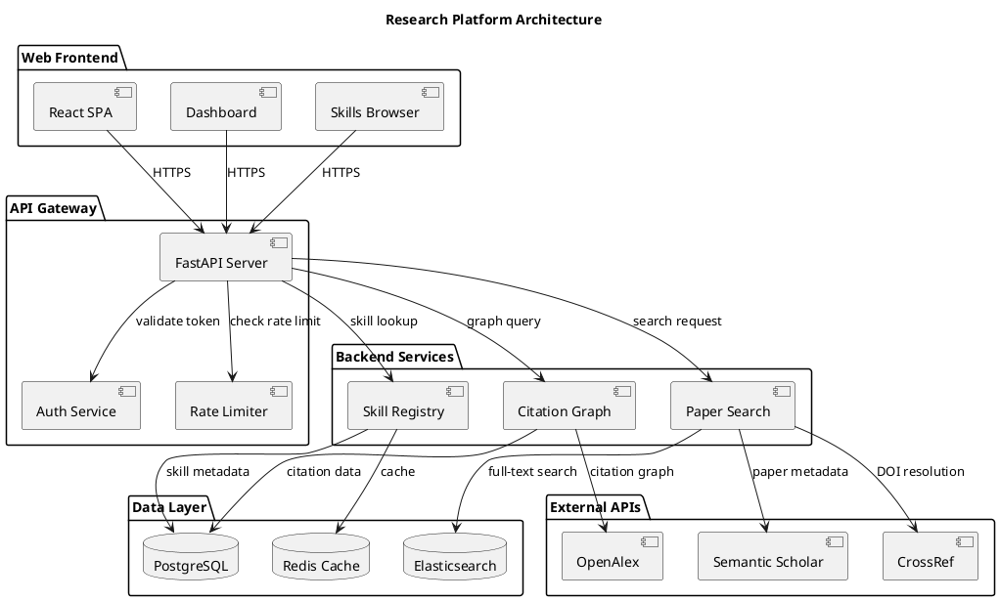
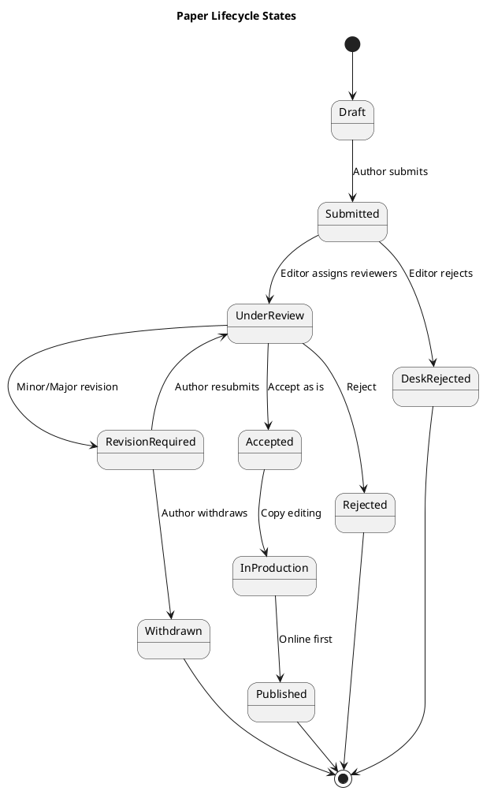
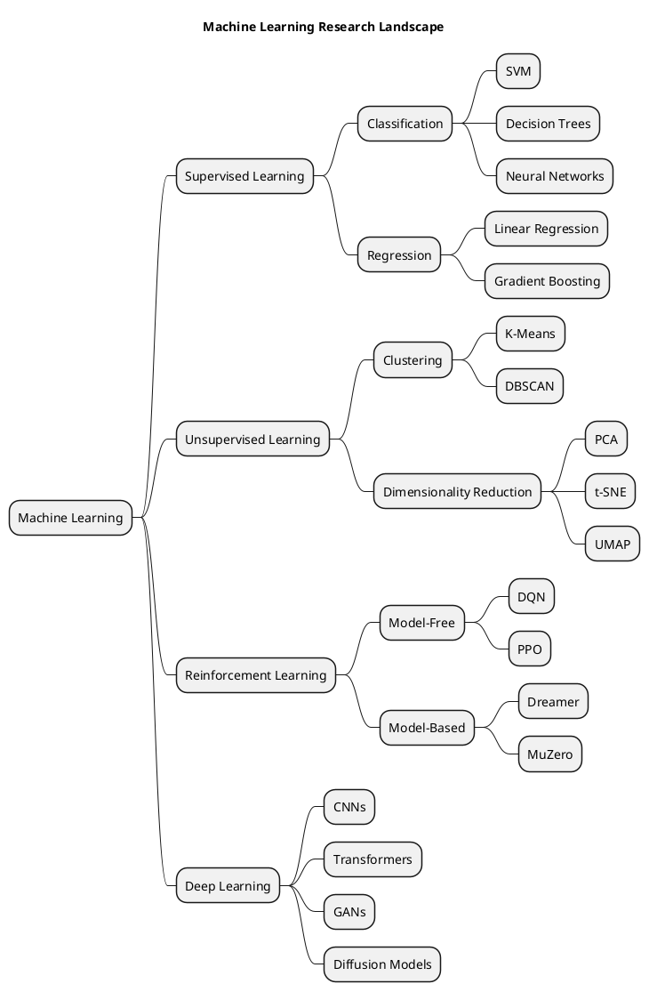

# PlantUML Guide

Create UML diagrams, architecture visualizations, flowcharts, and other technical diagrams using PlantUML's text-based notation for reproducible, version-controllable diagrams.

## Getting Started

PlantUML generates diagrams from plain text descriptions. Diagrams are defined in `.puml` files and rendered to PNG, SVG, or PDF.

### Installation Options

| Method | Command / URL | Best For |
|--------|--------------|----------|
| VS Code extension | Install "PlantUML" by jebbs | IDE integration |
| CLI (Java JAR) | `java -jar plantuml.jar diagram.puml` | Batch processing |
| Online server | plantuml.com/plantuml | Quick prototyping |
| Docker | `docker run plantuml/plantuml-server` | Self-hosted server |
| Python | `pip install plantuml` | Python integration |
| Jupyter | `pip install iplantuml` | Notebook integration |

### Basic Syntax



## Sequence Diagrams

Model interactions between components over time:



## Class Diagrams

Model system structure and relationships:



## Activity Diagrams (Flowcharts)

Model workflows and decision processes:



## Component Diagrams

Model system architecture:



## State Diagrams

Model system states and transitions:



## Gantt Charts

Plan research timelines:

```plantuml
@startuml
title Research Project Timeline

Project starts 2025-01-01

[Literature Review] starts 2025-01-01 and lasts 8 weeks
[Research Design] starts at [Literature Review]'s end and lasts 4 weeks
[IRB Approval] starts at [Research Design]'s end and lasts 6 weeks
[Data Collection] starts at [IRB Approval]'s end and lasts 12 weeks
[Data Analysis] starts at [Data Collection]'s end and lasts 8 weeks
[Paper Writing] starts at [Data Analysis]'s end and lasts 10 weeks
[Peer Review] starts at [Paper Writing]'s end and lasts 12 weeks
[Revision] starts at [Peer Review]'s end and lasts 6 weeks

-- Milestones --
[Proposal Defense] happens at [Research Design]'s end
[Conference Presentation] happens at [Data Analysis]'s end
[Submission] happens at [Paper Writing]'s end

@enduml
```

## Mind Maps

Organize research topics:



## Integration with LaTeX

```latex
\usepackage{plantuml}

\begin{plantuml}
@startuml
Alice -> Bob: Hello
Bob --> Alice: Hi
@enduml
\end{plantuml}

% Compile with: pdflatex -shell-escape paper.tex
```

## Integration with Markdown (Mermaid Alternative)

Many Markdown renderers (GitHub, GitLab, Notion) support Mermaid natively. PlantUML can be used via plugins or pre-rendering:

```python
# Pre-render PlantUML to SVG for Markdown embedding
import plantuml

server = plantuml.PlantUML(url="http://www.plantuml.com/plantuml/svg/")
svg_content = server.processes("""
@startuml
Alice -> Bob: Hello
@enduml
""")

with open("diagram.svg", "wb") as f:
    f.write(svg_content)
```

## Best Practices

1. **Version control your diagrams**: Store `.puml` files alongside code/documentation in git.
2. **Use consistent styling**: Define skinparams at the top of each file for consistent colors and fonts.
3. **Keep diagrams focused**: One diagram per concept; split complex architectures into multiple views.
4. **Add legends and notes**: Use `note left of`, `note right of`, or `legend` blocks to clarify semantics.
5. **Automate rendering**: Include PlantUML rendering in CI/CD pipelines to keep documentation current.
6. **Export as SVG**: Prefer SVG over PNG for scalable diagrams in papers and presentations.
